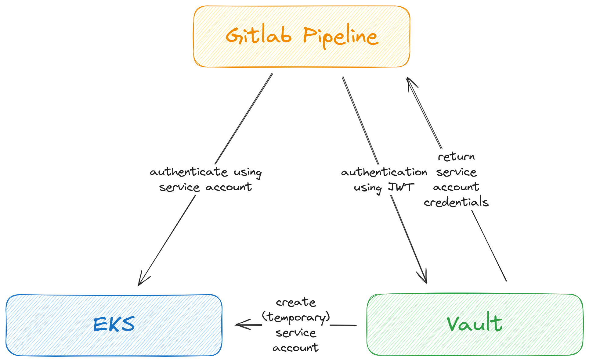

[.title]
= Autorisierung an EKS aus einer GitLab Pipeline mit HashiCorp Vault
Sascha Schmidt - E. Breuninger GmbH & Co

[.notes]
--
* Willkommen im Deep-Dive zu Autorisierung an ...
* Also wie wir das Problem der Anmeldung an einem Kubernetes Cluster aus einer Gitlab Pipeline heraus mittels Hashicorp Vault lösen
* Ich bin .. / Bei Operations Core Tooling
* Bekannteste Services sind Gitlab, IDP/Keycloak, Confluence, Jira
* Unsere workloads laufen großteils in Containern in der Regel auf K8s
* Unsere Rollouts laufen in der Regel vollständig automatisch daher war das ein Problem das wir lösen mussten
--

:revealjs_theme: white
:customcss: custom.css
:revealjs_history: true
:icons: font
// 20 minutes
:revealjs_totalTime: 1200
:source-highlighter: highlight.js
:revealjs_transition: slide

:revealjs_width: 1200

:revealjs_pdfseparatefragments: false

== Sicherer Zugriff auf EKS aus der GitLab Pipeline

[.notes]
--
Das Problem bzw. die klassischen Lösungsansätze

Wir haben also eine Pipeline und wollen auf einen Kubernetes Cluster zugreifen

* Credentials in Gitlab CI-Variablen
** langlebige Credentials
** ablaufende Credentials
** können verloren gehen
*** durch fehlkonfiguration im Projekt
*** malicious dependencies
*** bugs in Gitlab
* Runner Privileges (Instance Role)
** in der Regel nicht least priviledge da nicht pro Projekt ein dedizierter Runner existiert 
** jeder mit access hat den selben access
--

== Integration von HashiCorp Vault für Autorisierung 

[.notes]
--
* Anmeldung an Vault aus Pipeline
** Authnetifizierung via JWT
*** JWT ist signiert, Vault vertraut den Informationen
*** Username, Access Level, Project  ID, etc.
** Entscheidung über Autorisierung anhand dieser Information
** => welche Rolle und damit welche Privilegien (Namespace scoped)
* Vault erzeugt kurzlebige Credentials in EKS
* Anmeldung an EKS mit kurzlebigen Credentials
--

== Demo Time

== Questions?
